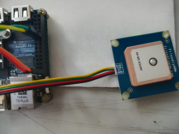
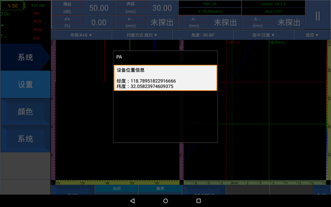

# android gps

根据手册上的说明，GPS串口应该接在UART3上。此模块无需初始化，只要上电就会源源不断的将GPS数据通过串口发送到主控制器。

GPS模块接线方式如下所示：



Android系统驱动GPS模块的两个方案：

方案1：

使用android系统Location服务来获取位置信息。
此方案在手机上尝试成功，但是在开发板上尝试失败。原因可能是开发板没有装配支持android系统的GPS驱动程序。
GPS模块提供的官方资料也是针对linux系统的驱动方式

方案2：
采用直接通过串口读取GPS数据，然后通过解析NMEA协议获取位置信息。
参考网上的一个例程
参考源码：https://github.com/ehsanaboo/GPSNMEA
该例程


但是要注意：
1.	访问串口需要Root权限。如果是新买的板子需要重新烧写android系统
2.assets/


节刚过如图所示：



# NMEA0813协议介绍：

GPS数据遵循NMEA-0183协议，该数据标准是由NMEA（National Marine Electronics Association，美国国家海事电子协会）于1983年制定的。统一标准格式NMEA-0183输出采用ASCII 码，其串行通信的参数为：波特率＝4800bps，数据位＝8bit，开始位=1bit，停止位＝1bit，无奇偶校验。
数据传输以“语句”的方式进行，每个语句均以“$”开头，然后是两个字母的“识别符”和三个字母的“语句名”，接着就是以逗号分割的数据体，语句末尾为校验和，整条语句以回车换行符结束。
NMEA-0183的数据信息有十几种，这些信息的作用分别是：$GPGGA：输出GPS的定位信息；$GPGLL：输出大地坐标信息；$GPZDA：输出UTC时间信息；$GPGSV：输出可见的卫星信息；$GPGST：输出定位标准差信息；$GPGSA：输出卫星DOP值信息；$GPALM：输出卫星星历信息；$GPRMC：输出GPS推荐的最短数据信息等。


一、 输出语句说明：
1，$GPRMC语句
（Recommended Minimum Specific GPS/TRANSIT Data－RMC，推荐定位信息1次/1秒）
    对于一般的GPS动态定位应用，GPRMC语句完全满足要求。该语句中包括经纬度、速度、时间和磁偏角等字段，这些数据为导航定位应用提供了充分的信息。下表详细说明GPRMC语句中的各个字段：
```
$GPRMC，<1>，<2>，<3>，<4>，<5>，<6>，<7>，<8>，<9>，<10>，，<12>
字段 $GPRMC语句意义——取值范围
<1> UTC时间：hhmmss.ss——000000.00~235959.99
<2> 状态，有效性 ——A表示有效；V表示无效
<3> 纬度格式：ddmm.mmmm——0000．00000~8959.9999 （标准的度分格式）
<4> 南北半球——N北纬；S南纬
<5> 经度格式：dddmm.mmmm——00000.0000~17959.9999 （标准的度分格式）
<6> 东西半球——E表示东经；W表示西经
<7> 地面速度——000.00~999.999
<8> 速度方向——000.00~359.99
<9> 日期格式，月日年——010100~123199
<10> 磁偏角，单位：度——00.00~99.99
磁偏角方向——E表示东；W表示西
<12> 模式指示及校验和—— A=自主定位，D=差分，E=估算，N=数据无效
```
例如
```
：$GPRMC,074529.82,A,2429.6717,N,11804.6973,E,12.623,32.122,010806,,W,A*08
```

2，$GPGGA语句
（Global Positioning System Fix Data－GGA，GPS定位信息, 输出1次/1秒）
    GPS定位主要数据，该语句中包括经纬度、质量因子、HDOP、高程、基准站号等字段。下表详细说明GPGGA语句中的各个字段：
```
$GPGGA，<1>，<2>，<3>，<4>，<5>，<6>，<7>，<8>，<9>，<10>，，<12>,，<14>
字段 $GPGGA语句意义——取值范围
<1> UTC时间：hhmmss.ss——000000.00~235959.99
<2> 纬度，格式：ddmm.mmmm ——0000．00000~8959.9999 （标准的度分格式）
<3> 南北半球——N北纬；S南纬
<4> 经度格式：dddmm.mmmm ——00000.0000~17959.9999 （标准的度分格式）
<5> 东西半球——E表示东经；W表示西经
<6> 质量因子——0=未定位，1=GPS单点定位固定解，2=差分定位，3=PPS解；4=RTK固定解；5=RTK浮点解；6=估计值；7=手工输入模式；8=模拟模式；
<7> 应用解算位置的卫星数——00~12
<8> HDOP，水平图形强度因子——0.500~99.000 ；大于6不可用
<9> 天线高程（海平面）——－9999.9～99999.9
<10> 线线高程单位(m) ——m
大地水准面起伏——地球椭球面相对大地水准面的高度
<12> 大地水准面起伏单位(m)   ——m
<13> 差分GPS数据期——差分时间（从最近一次接收到差分信号开始的秒数，如果不是差分定位将为空），不使用DGPS时为空
<14> 基准站号——0000~1023；不使用DGPS时为空
```

```
$GPGGA,074529.82,2429.6717,N,11804.6973,E,1,8,1.098,42.110,M,,M,,*76
```

3，$GPGSV语句
（GPS Satellites in View－GSV，可见卫星信息，1次/5秒）
    GPS可见星的方位角、俯仰角、信噪比等每条语句最多包括四颗卫星的信息，每颗卫星的信息有四个数据项，即：(4)－卫星号，(5)－仰角，(6)－方位角，(7)－信噪比
```
$GPGSV,<1>,<2>,<3>,<4>,<5>,<6>,<7>,<8>,<9>,<10>,<11>,<12>,<13>,<14>,<15>,<16>,<17>,<18>,<19>
字段 $GPGSV语句意义——取值范围
<1> 总的GSV语句电文数——0~12
<2> 当前GSV语句号
<3> 可视卫星总数——0~32
<4> 卫星号——1~32
<5> 仰角——00～90
<6> 方位角——000～359
<7> 信噪比——00～99dB无表未接收到讯号
<8> 卫星号——1~32
<9> 仰角——00～90
<10> 方位角——000～359
信噪比——00～99dB无表未接收到讯号
<12> 卫星号——1～32
<13> 仰角——00～90
<14> 方位角——000～359
<15> 信噪比——00～99dB 无表示未接收到讯号
<16> 卫星号——1～32
<17> 仰角——00～90
<18> 方位角——000～359
<19> 效验和，格式：*效验和——检查位
```

```
$GPGSV,3,1,11,1,83,54,32,3,19,192,28,6,26,57,36,7,51,140,37*7D
$GPGSV,3,2,11,14,40,136,34,16,64,266,36,20,21,293,,22,2,168,*4C
$GPGSV,3,3,11,23,10,321,,25,53,7,40,30,2,46,*48
```

4，$GPVTG语句
(Track Made Good and Ground Speed－VTG，地面速度信息）
```
格式：$GPVTG,<1>,T,<2>,M,<3>,N,<4>,K,<5>*hh
字段 $GPVTG语句意义——取值范围
<1> 以真北为参考基准的地面航向——000.000~359.999
<2> 以磁北为参考基准的地面航向——000.000~359.999
<3> 地面速率——000.000~999.999节
<4> 地面速率——0000.0~1851.8公里/小时
<5> 模式指示——A=自主定位，D=差分，E=估算，N=数据无效(仅NMEA0183 3.00版本输出)
<6> hh 校检位
```
```
$GPVTG,257.314,T,257.314,M,10.739,N,19.888,K,A*2F
```

5，$GPGSA语句
（GPS DOP and Active Satellites－GSA，当前卫星信息，1次/1秒）
GSA : GNSS 的当前卫星和精度因子,包括可见卫星PRN号,以及PDOP、HDOP、VDOP。如：
```
<1>     模式 ——M = 手动， A = 自动。
<2>     定位类型——1 = 未定位， 2 = 二维定位， 3 = 三维定位。
<3>     PRN 数字——01 至 32 表天空使用中的卫星编号，最多可接收12颗卫星信息。正在用于解算位置的卫星号（01~32，前面的0也将被传输）。
<4>     PDOP位置精度因子——0.5～99.9  
<5>     HDOP水平精度因子——0.5～99.9
<6>     VDOP垂直精度因子——0.5～99.9
<7>     Checksum.(检查位).
```

```
$GPGSA,<1>,<2>,<3>,<3>,,,,,<3>,<3>,<3>,<4>,<5>,<6>,<7>
$GPGSA,A,3,19,11,03,23,27,13,16,,,,,,3.43,1.67,2.99*0E
```

6，$GPGLL语句
（输出大地坐标信息）
```
$GPGLL,<1>,<2>,<3>,<4>,<5>,<6>,<7>*61
字段 $GPGLL语句意义——取值范围
<1> 纬度：ddmm.mmmmm——0000．00000~8959.9999
<2> 南纬或北纬——北纬N，S南纬
<3> 经度：dddmm.mmmmm——0000．00000~17959.99999
<4> 东、西经 ——东经E，西经W
<5> UTC时间——hh:mm:ss
<6> 数据状态——A有效，V无效
```

```
$GPGLL,2431.25310,N,11806.15429,E,081401.00,A,A*61
```

7，$GPZDA 语句
（输出UTC时间和日期信息）
```
$GPZDA, <1>,<2>,<3>,<4>,<5>*hh
字段 $GPZDA语句意义——取值范围
<1> 时间：hhmmss.ss——0000000.00～235959.99
<2> 日——00～31
<3> 月——00～12
<4> 年——0000～9999
<5> 地方时与世界时之差
<6> 检校位 *hh——*
```

```
$GPZDA,081401.00,14,09,2006,00,00*62
```

8，$GPGST 语句
（GPS 伪距噪声统计,包括了三维坐标的标准偏差信息）
字段——示例——说明
Sentence ID ——$GPGST
UTC Time——024603.00——UTC time of associated GGA fix
RMS deviation——3.2——Total RMS standard deviation of ranges inputs to the navigation solution
Semi-major deviation——6.6——Standard deviation (meters) of semi-major axis of error ellipse
Semi-minor deviation——4.7——Standard deviation (meters) of semi-minor axis of error ellipse
Semi-major orientation——47.3——Orientation of semi-major axis of error ellipse (true north degrees)
Latitude error deviation——5.8——Standard deviation (meters) of latitude error
Longitude error deviation——5.6——Standard deviation (meters) of longitude error
Altitude error deviation——22.0——Standard deviation (meters) of latitude error
Checksum—— *58
$GPGST,024603.00,3.2,6.6,4.7,47.3,5.8,5.6,22.0*58


9，$GPCN0语句
   各颗用于解算的卫星信噪比：
```
$GPCN0,30,40,35,26,24,36,31,38
```

二、 输出时间说明：
　GPGGA(1次/1秒)
　GPGSA(1次/1秒)
　GPGSV(1次/5秒)
　GPRMC(1次/1秒)
　另可选用GLL,VTG或SiRF二进制格式.


三、坐标系统WGS84
WGS－84坐标系（World Geodetic System）是一种国际上采用的地心坐标系。坐标原点为地球质心，其地心空间直角坐标系的Z轴指向国际时间局（BIH）1984.0定义的协议地极（CTP）方向，X轴指向BIH1984.0的协议子午面和CTP赤道的交点，Y轴与Z轴、X轴垂直构成右手坐标系，称为1984年世界大地坐标系。这是一个国际协议地球参考系统（ITRS），是目前国际上统一采用的大地坐标系。GPS广播星历是以WGS-84坐标系为根据的。
WGS84坐标系，长轴6378137.000m，短轴6356752.314，扁率1/298.257223563。


DOP值有三种测量类型：
水平、垂直和说明（mean）。HDOP测量它和经纬度的关系作为精度，VDOP测量他和海拔的关系作为精度，PDOP，给出一个关于经纬度、海拔精度的完整等级。每个DOP值都是1到50之间数值，其中50 表示非常差的精度，1则表示很理想的精确度。
表2-1列出了划分的一份精确的PDOP值细目分类。PDOP分类描述：
PDOP值——评价——说明
1～2——理想——这是最高的信任级别，应用程序可以在任何时候获取最高的精度
2～3——极好——值得信任的级别，位置的测量相当精确，可以应用于绝大多数应用程序，但是有些非常敏感的应用程序就不行了
4～6——好——这是用来做商业应用的最低等级。位置的测量可以用来做线路导航建议
7～8——中等——位置测量可以用来计算，但是质量还应该提高。推荐用语天空观察
9～20——中下——信任级别很低。位置测量结果应该丢弃或者仅用于粗略估计当前位置
21～50——差——在这个级别的测量结果是不精确的，大概会有半个足球场大的误差，应该丢弃


四，常用精度
PDOP：位置精度因子（Position Dilution of Precision），直译为“精度强弱度”，通常翻译为“相对误差”。具体含义是：由于观测成果的好坏与被测量的人造卫星和接收仪间的几何形状有关且影响甚大，所以计算上述所引起的误差量称为精度的强弱度。天空中卫星分布程度越好，定位精度越高（数值越小精度越高）。PDOP表示三维位置定位精度与导航台几何配置关系的一个参数。在全球定位(GPS)系统中，等于用户位置的径向误差(1°)与用户到卫星的距离测量误差(1°)的比值。
Pdop取值范围为：0.5--99.9，为纬度、经度和高程等误差平方和的开根号值，所以Pdop的平方 =Hdop 的平方 +Vdop 的平方。HDOP2+VDOP2=PDOP2
+ PDOP( position dilution of precision ) 三维位置精度因子：为纬度、经度和高程等误差平方和的开根号值
+ TDOP（time dilution of precision ）钟差精度因子：为接收仪内时表偏移误差值。
+ HDOP（horizontal dilution of precision ）水平分量精度因子：为纬度和经度等误差平方和的开根号值。
+ VDOP（vertical dilution of precision ）垂直分量精度因子
age:差分延时
VRMS:水平残差
HRMS:垂直残差
RMS ：HRMS2+VRMS2=RMS2
距离基准站的距离：两个经纬度坐标之间的距离计算：
```
1.		//////////两个经纬度坐标计算距离///////////////////////
2.		private double EARTH_RADIUS = 6378.137;//地球半径
3.		private double rad(double d)
4.		{
5.		   return d * Math.PI / 180.0;
6.		}
7.	 
8.		public double GetDistance(double lat1, double lng1, double lat2, double lng2)
9.		{
10.		   double radLat1 = rad(lat1);
11.		   double radLat2 = rad(lat2);
12.		   double a = radLat1 - radLat2;
13.		   double b = rad(lng1) - rad(lng2);
14.	 
15.		   double s = 2 * Math.asin(Math.sqrt(Math.pow(Math.sin(a/2),2) +
16.		    Math.cos(radLat1)*Math.cos(radLat2)*Math.pow(Math.sin(b/2),2)));
17.		   s = s * EARTH_RADIUS;
18.		   s = Math.round(s * 10000) / 10000;
19.		   return s;
20.		}
```
