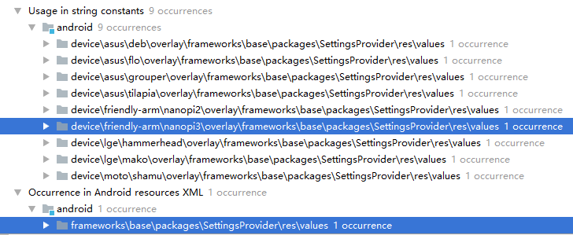

# Android5.1裁剪

版本|日期|作者
--|--|--
1.0  |   |周星宇  

## 1.底层系统服务裁剪

\system\core\rootdir\init.rc

>init.rc文件语法参考
https://www.jianshu.com/p/cb73a88b0eed

### 1.1 Action

动作的一般格式如下：
```
on  <trigger>           ## 触发条件
      <command>     ##执行命令
      <command1>   ##可以执行多个命令
```
从上面，我们可以知道，一个Action其实就是响应某事件的过程。即当<trigger>所描述的触发事件产生时，依次执行各种command(同一事件可以对应多个命令)。

### 1.2 service

"服务"(service)的关键字 service后面跟着的是服务名称。我们可以使用"start"命令加"服务名称"来启动一个服务。关键字以下的行称为"选项"，没一个选项占用一行，选项也有多种，常见的"class"表示服务所属的类别。

services 其实是可执行程序，它们在特定选项的约束下是被init程序运行或者重启(service可以在配置中指定是否需要退出重启，这样当service出现异常crash时就可以有机会复原)
```
service <name><pathname> [ <argument> ]*
    <option>
    <option>
```
我们简单的解释上面的参数

+ \<name>：表示此service的名称
+ \<pathname>：此service所在路径。因为是可执行文件，所以一定有存储路径
+ \<argument>：启动service所带的参数
+ \<option>：对此service的约束选项

### 1.3 Android所有系统服务

本节列出了android5.1系统init.rc中所有使用service关键字启动的系统服务。

服务名称|功能|操作
--|--|--
ueventd|创建或删除设备节点的守护进程|不能删
logd|打印调试日志|看使用
healthd|获取电池电量数据|看使用
adbd|adb守护进程|别删吧
lmkd  |lowmemorykiller驱动程序,终止不必要的程来缓解内存压力 https://www.jianshu.com/p/1ef6e8a1c773|不知道
servicemanager|服务管理进程,binder通信框架组成部分|不能删
vold|外部存储设备管理守护进程|不能删
netd|网络守护进程|不能删
debuggerd|应用程序崩溃诊断守护进程|可删
rild|Android中负责通信功能的Telephony中间层 https://blog.csdn.net/jason_wzn/article/details/53232022 |应该可以删
surfaceflinger|Android界面显示系统|不能删
drmserver|数字版权管理服务|可删
mediaserver|媒体服务|不能删
vdc|加密库crypto|可删
bootanimation|开机动画|不能删
installd|应用程序安装守护进程|不能删
racoon|和网络有关|不知道
mtpd  |媒体传输协议守护进程|不知道
keystore|证书服务|可删
dumpstate|一种性能测试工具|可删
mdnsd  |多播DNS守护进程|可删  
uncrypt|也和加密有关|可删

## 2.上层系统服务裁剪

### 2.1 上层服务启动流程

SystemServer功能为启动各种上层服务。源码位于
\frameworks\base\services\java\com\android\server\SystemServer.java

不同Android版本有不同的实现。至少Android5.1版本和4.2.2版本已经不一样了。本文介绍5.1版本裁剪

启动上层服务的代码在run()方法中。

``` java
private void run() {
//.......
        // Initialize native services.
        System.loadLibrary("android_servers");
        nativeInit();
//......................
        // Start services.
        try {
            startBootstrapServices();   //这里面启动的服务不能删
            startCoreServices();  //这里也不能删
            startOtherServices(); //主要删这里的
        } catch (Throwable ex) {
            Slog.e("System", "******************************************");
            Slog.e("System", "************ Failure starting system services", ex);
            throw ex;
        }
//.............
}
```

所以上层服务裁剪就是在startOtherServices()中裁剪服务的启动代码。


### 2.2 上层服务裁剪

这里懒得整理了，具体可以参考裁剪过后的java文件


参考
https://blog.csdn.net/touxiong/article/details/80533157

## 3.应用程序裁剪

### 3.1 介绍

系统内置应用程序位于源码路径下packages／目录中，内置应用程序区分

+ 普通应用程序:app/
+ 非官方应用程序:experimental/
+ 输入法:inputmethods/
+ 提供器:providers/
+ 屏幕保护程序:screensaver/
+ 墙纸:wallpapers/

内置应用程序独立的源码工程形式存在于相应的目录中，随android源码一同编译生成apk文件。编译方式与android源码相同，采用android.mk文件控制编译巧为。android源巧的这种编译方式特点在于编译所需要的环境变量、路径信息、函数定义等全部集中记录，而各个模块通过独立的android.mk文件来控制，可独立编译而互不影响。因此栽剪系统内置应用程序时仅需要注释掉对应的android.mk文件或者直接将应用程序的源码工程整体删除即可通过编译。需要注意的是个别的应用程序或提供器被其他应用程序所依赖，删除可能导致其他应用程序运行崩溃，因此最终的应用程序栽剪方案需要通过实验分析确定。

系统应用程序框架的核也应用程序位于源码路径frameworks/base/packages目录下，该目录下的应用程序实际位于框架层，与框架层的系统服务相关联。贸然删除此目录下的应用程序有可能导致系统无法正常运行，因此一般不对此目录下的应用程序进行裁剪。

设备制造商的应用程序通常位于源码路径下的vendor/目录中，除了应用程巧的apk文件之外，还有可能存在预编译的驱动程序（动态共享库.so文件）化及其他系统工具等。通常设备制造商的私有应用程序和文件不提供源码，也不需要进行编译，而是在android源码编译完成后再打包进系统镜像文件中。

### 3.2 优化的应用

apps/目录中剩下的应用如图所示

```
packages/
├── apps
│   ├── BasicSmsReceiver
│   ├── Bluetooth
│   ├── Browser
│   ├── Calculator
│   ├── Calendar
│   ├── CellBroadcastReceiver
│   ├── CertInstaller
│   ├── DeskClock
│   ├── Email
│   ├── Exchange
│   ├── HTMLViewer
│   ├── InCallUI
│   ├── KeyChain
│   ├── LegacyCamera
│   ├── Mms
│   ├── Nfc
│   ├── OneTimeInitializer
│   ├── PackageInstaller
│   ├── Protips
│   ├── QuickSearchBox
│   ├── Settings
│   ├── SmartCardService
│   ├── SoundRecorder
│   ├── SpareParts
│   ├── SpeechRecorder
│   ├── Stk
│   ├── Tag
│   ├── Terminal
│   ├── TvSettings
│   └── UnifiedEmail
├── experimental
│   ├── Bummer
│   ├── DreamTheater
│   ├── ExampleImsFramework
│   ├── LoaderApp
│   ├── NotificationListenerSample
│   ├── NotificationLog
│   ├── NotificationShowcase
│   ├── PrintApp
│   ├── PrintService
│   ├── PrintService2
│   ├── procstatlog
│   ├── RpcPerformance
│   ├── SELinux
│   └── TestBack
├── inputmethods
│   ├── LatinIME
│   └── OpenWnn
├── providers
│   ├── ApplicationsProvider
│   ├── CalendarProvider
│   ├── ContactsProvider
│   ├── DownloadProvider
│   ├── MediaProvider
│   ├── PartnerBookmarksProvider
│   ├── TelephonyProvider
│   ├── TvProvider
│   └── UserDictionaryProvider
├── screensavers
│   ├── Basic
│   ├── PhotoTable
│   └── WebView
├── services
│   └── Mms
└── wallpapers
    └── Basic
```

### 3.3 修改桌面应用

#### 将apk指定为桌面
在AndroidMenifest.xml中指定作为桌面启动。

``` xml
<intent-filter>
  <action android:name="android.intent.action.MAIN" />
  <category android:name="android.intent.category.HOME" />
  <category android:name="android.intent.category.DEFAULT" />
  <category android:name="android.intent.category.MONKEY"/>
</intent-filter>
```

#### 去除系统自带桌面

在源码中搜索"android.intent.category.HOME"关键字得到如下结果
```
development\apps\SdkSetup
development\samples\Home
packages\apps\Launcher2
packages\apps\Launcher3
packages\apps\ManagedProvisioning
packages\apps\Provision
packages\apps\Settings
```
这些就是定义了作为桌面应用的系统应用。如果需要将我们的app作为桌面应用的话需要去除这些应用的桌面设定。要么裁减掉整个应用，要么删除AndroidMenifest.xml中的"android.intent.category.HOME"设定。

#### 将apk编入system.img

>注:网上找的所有方法对于PA应用程序来讲都GG了，所以最后PA程序并没有预置到系统镜像中。但是下面介绍的方法对于其他的apk可能会管用。

在自己源码的packages\apps\路径下，新建PA文件夹，然后将要添加的第三方apk以及apk依赖的so库拷贝到该文件夹下，在PA/下新建Android.mk文件，内容如下：

```
include $(CLEAR_VARS)
LOCAL_MODULE := PA
LOCAL_MODULE_PATH := $(TARGET_OUT_APPS_PRIVILEGED)
LOCAL_MODULE_SUFFIX := $(COMMON_ANDROID_PACKAGE_SUFFIX)	#module的后缀，=.apk
LOCAL_MODULE_CLASS := APPS	#标识所编译模块最后放置的位置,APPS 表示放置在/system/app
LOCAL_MODULE_OWNER := 601
LOCAL_MODULE_TAGS := optional
#LOCAL_BUILT_MODULE_STEM := package.apk
LOCAL_SRC_FILES := PA.apk
LOCAL_CERTIFICATE := platform
include $(BUILD_PREBUILT)

LOCAL_POST_PROCESS_COMMAND := $(shell unzip $(LOCAL_PATH)/*.apk -d $(LOCAL_PATH)/apkdump/)
LOCAL_POST_PROCESS_COMMAND := $(shell cp -r $(LOCAL_PATH)/apkdump/lib/armeabi-v7a/*.so $(TARGET_OUT)/lib/)
LOCAL_POST_PROCESS_COMMAND := $(shell rm -rf $(LOCAL_PATH)/apkdump)
```

然后编辑build/target/product/core.mk文件，将该apk的名字加入到PRODUCT_PACKAGES中，之后执行make编译后会
+ 在out/目录下的system/PA/文件夹，文件夹的内容即为PA.apk
+ out/目录下的system/lib/文件夹中出现依赖的so库
重新烧录程序到机器中即可发现添加的apk已经合入system.img中

参考
+ https://blog.csdn.net/newairzhang/article/details/50631311
+ https://blog.csdn.net/love000520/article/details/52193597
+ https://blog.csdn.net/sdvch/article/details/44728691
+ https://284772894.iteye.com/blog/1882946


## 4.其他裁剪

### 4.1 去除锁屏

想要开机后直接启动自己的app还需要去除开机后的解锁界面以及长时间无操作后的锁屏画面。方法如下:

frameworks/base/packages/SettingsProvider/res/values/defaults.xml
``` xml
<integer name="def_screen_off_timeout">-1</integer>
```

对于nanoPC-T3来说，在device目录中重写了一部分系统配置，所以那个路径下的也要改



以毫秒为单位，设为-1即可，重新编译Setting Provider模块但是只是这样修改的话，启动后依旧会进入锁屏状态，解锁之后就再也不会锁屏了开机不锁屏
frameworks\base\packages\SystemUI\src\com\android\systemui\keyguard\KeyguardViewMediator.java
``` java
/**    
 * External apps (like the phone app) can tell us to disable the keygaurd.   
 */  
 private boolean mExternallyEnabled = true;改为false

```

### 4.2 去除导航栏

如果需要去除系统的导航栏(屏幕边上的三个虚拟按键),则做如下修改

device\friendly-arm\nanopi3\overlay\frameworks\base\core\res\res\values\config.xml
中更改config_showNavigationBar为false即为关闭，为true即为打开。


参考:
https://blog.csdn.net/maetelibom/article/details/77466851
Android将第三方apk文件编译生成到system.img中
https://blog.csdn.net/love000520/article/details/52193597

## 附录

adb shell中查看已安装的APK
```
pm list packages
```

快速生成单个镜像文件的方法
```
make systemimage    - system.img
make userdataimage  - userdata.img
make ramdisk         - ramdisk.img
```

想要不make clean就能刷新程序
